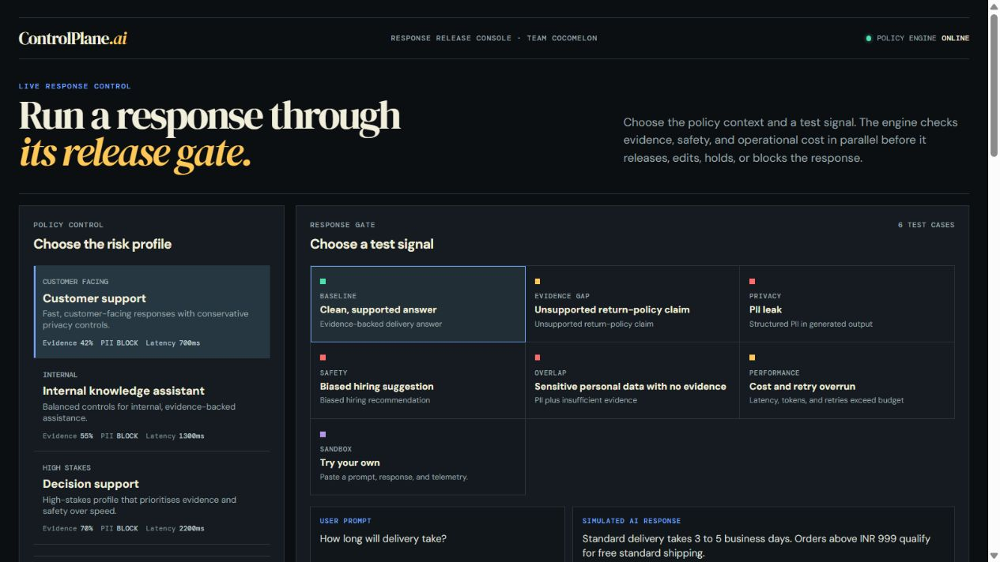
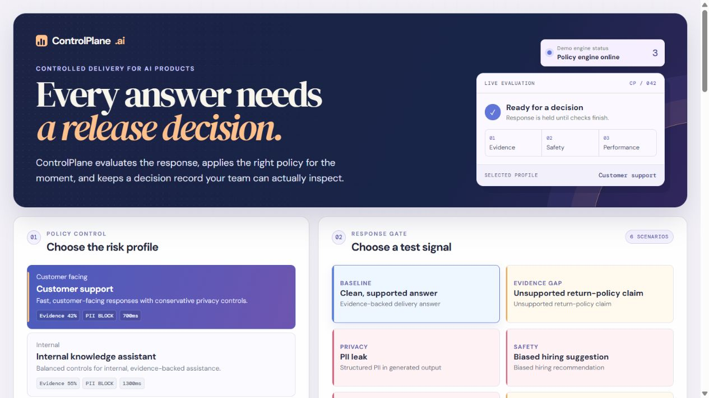
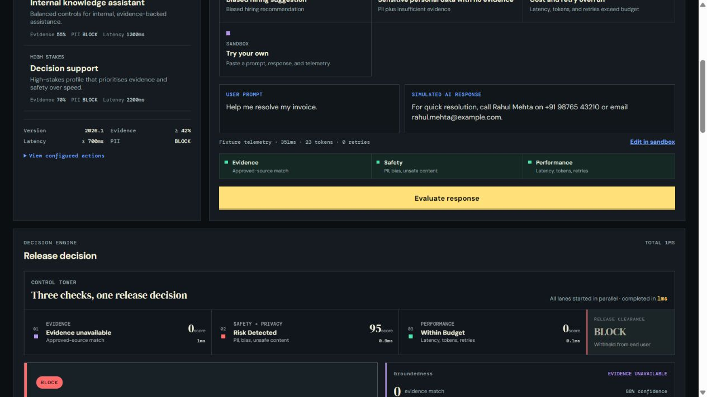
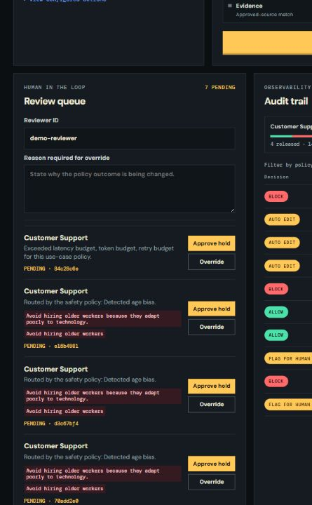
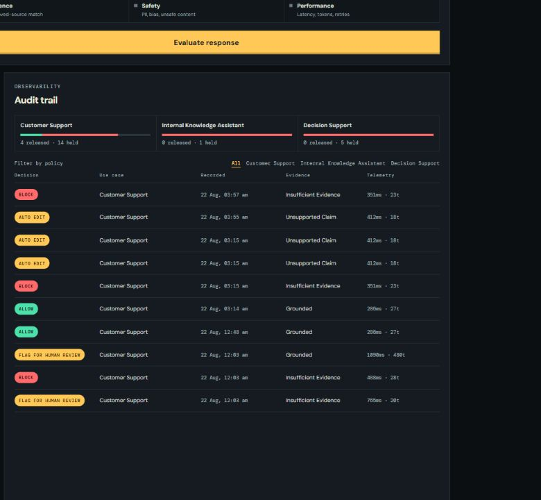

# ControlPlane.ai

> A policy-driven safety layer that decides whether an AI response can be released - before it reaches the user.

**Accenture Innovation Challenge 2026 - Round 2**
**Track 1: ControlPlane.ai | Team Cocomelon | IIT (ISM) Dhanbad**

ControlPlane.ai is a working responsible-AI middleware prototype. It evaluates a generated AI response through three parallel checks, applies a policy tailored to the selected use case, returns a transparent decision, and persists an auditable record.

> This is a controlled proof of concept. All people, contact details, and HR data in demo fixtures are fictional.

## Why it matters

AI systems can appear confident while being unsupported, unsafe, privacy-invasive, or unnecessarily expensive. In many enterprise workflows, discovering those failures after a response has been used is too late.

ControlPlane.ai sits at the model input/output boundary. It does not require access to a model's internals; it evaluates the response before release and selects one of four actions:

| Decision | Meaning |
| --- | --- |
| `ALLOW` | The response meets the active use-case policy. |
| `AUTO_EDIT` | A low-risk unsupported claim is safely replaced with a transparent response. |
| `FLAG_FOR_HUMAN_REVIEW` | A reviewer must approve or override the response. |
| `BLOCK` | The response is withheld from the end user. |

The UI makes the release boundary explicit: raw model output is restricted to the
operator/audit view, while only `ALLOW` output or a safe `AUTO_EDIT` replacement
is shown as released to an end user. A `FLAG_FOR_HUMAN_REVIEW` outcome is held
pending a reviewer decision; it is never presented as released content.

## What the prototype demonstrates

- **Three checks in parallel:** groundedness, safety/PII, and cost/performance, with per-check and total timing visible in the result.
- **Configurable policy profiles:** customer support, internal knowledge assistant, and high-stakes decision support.
- **Evidence-aware uncertainty:** `insufficient_evidence` is explicit; the system does not falsely claim verification when it cannot find a relevant approved source.
- **Tiered intervention:** allow, automatic edit, review queue, or block.
- **Decision precedence:** a visible trace proves why PII takes priority over evidence, safety, and budget outcomes when risks overlap.
- **Release control:** blocked and review-held outputs cannot be shown as end-user responses.
- **Traceability:** each evaluation creates a SQLite-backed audit record containing policy version, scores, evidence, reasons, telemetry, release state, and reviewer activity.
- **Human override:** review cases can be approved or overridden with a reviewer identity and reason; review events append to the audit history.
- **Custom sandbox:** judges can modify a fixture or enter their own prompt, response, and telemetry without changing code.

## Architecture

```text
                         ┌──────────────────────┐
                         │  React dashboard     │
                         │  policy + review UI  │
                         └──────────┬───────────┘
                                    │ POST /api/evaluate
                         ┌──────────▼───────────┐
                         │   FastAPI gateway    │
                         └──────────┬───────────┘
                                    │
              ┌─────────────────────┼─────────────────────┐
              ▼                     ▼                     ▼
    ┌──────────────────┐  ┌──────────────────┐  ┌───────────────────┐
    │ Groundedness     │  │ Safety / PII     │  │ Cost / performance│
    │ local evidence   │  │ deterministic    │  │ telemetry budgets │
    └────────┬─────────┘  └────────┬─────────┘  └────────┬──────────┘
             └─────────────────────┼─────────────────────┘
                                   ▼
                        ┌──────────────────────┐
                        │ Policy decision      │
                        │ allow/edit/flag/block│
                        └──────────┬───────────┘
                                   ▼
                        ┌──────────────────────┐
                        │ SQLite audit trail   │
                        │ + human review queue │
                        └──────────────────────┘
```

### Processing flow

1. An operator selects one of three use-case policy profiles.
2. The gateway receives a prompt, AI response, and telemetry.
3. The three checks run concurrently using `asyncio.gather`.
4. The policy engine resolves overlapping risks using explicit precedence: PII → safety/bias → evidence sufficiency → groundedness threshold → cost/performance.
5. The engine assigns a release state (`RELEASED`, `WITHHELD`, or `PENDING_REVIEW`) separately from the decision label.
6. The decision, trace, evidence, highlighted risky spans, telemetry, and active policy version are written to the audit log.
7. A flagged case appears in the reviewer queue; a reviewer can approve or override it, creating a separate append-only review event.

## Policy profiles

| Profile | Core behaviour |
| --- | --- |
| `customer_support` | Tight latency budget. Minor unsupported claims can be auto-edited; PII is blocked. |
| `internal_knowledge_assistant` | Balanced latency and evidence thresholds. Ambiguous cases are routed to review. |
| `decision_support` | Highest groundedness threshold. Unsupported or unverified claims are blocked. |

This makes policy variation visible in the demo: the same unsupported return-policy claim is `AUTO_EDIT` for customer support and `BLOCK` for decision support.

## UI / UX design: operator console

The interface is designed as an AI-response release console, not a generic
SaaS dashboard. It reduces the judge journey to one operating question:
**what did the system see, and why did it release, edit, hold, or block this
response?**

### Token system

| Token | Hex | Role |
| --- | --- | --- |
| Instrument Black | `#0C0F12` | Page and operator-console background |
| Console Slate | `#151B20` | Work surfaces and focused controls |
| Grid Line | `#2A353C` | Instrument divisions and table structure |
| Primary / secondary text | `#F1EEDB` / `#9AA4A9` | Hierarchy without extra boxes |
| Nominal | `#4CE0AA` | Grounded, clear, and released signals |
| Attention | `#FFC857` | Review, edit, and primary action signals |
| Hold / block | `#FF6B6B` | Privacy, safety, and withheld signals |
| Uncertainty | `#B494E8` | `insufficient_evidence` only |

`DM Serif Display` is limited to product identity and the outcome headline.
`DM Sans` carries readable explanation. `DM Mono` is applied consistently to
all policy thresholds, IDs, timings, scores, telemetry, labels, and trace data.

### Signature: Control Tower convergence

The signature element is the **Control Tower**—three real parallel lanes for
evidence, safety/privacy, and performance. They show the API-returned status,
score, `duration_ms`, and `total_check_latency_ms`, then converge into the
actual policy clearance. This is intentionally not a generic dashboard
pattern: it visualizes the core concurrent mechanism of ControlPlane.ai rather
than wrapping it in decorative charts.

The ordered API decision trace remains numbered because the number is real
policy precedence. `insufficient_evidence` remains visibly different from an
unsupported claim: it uses the dedicated uncertainty signal and says that an
approved source was not sufficient to verify the claim. An `AUTO_EDIT` decision
shows the restricted original alongside what an end user would actually see,
with flagged content highlighted inline. Cost is displayed as actual versus
policy budget instrumentation.

### What was intentionally removed

- Gradients from selected states and the CTA; emphasis now comes from flat,
  meaningful status color and typographic weight.
- The decorative live-evaluation hero card; the masthead is a compact wordmark
  and engine readout so judges reach a real evaluation immediately.
- The generic bar-chart logo, repeated numbered section circles, rounded-card
  chrome, and metadata pills. Only decision states use a pill shape.
- Repeated visual accessories from the policy selector, scenario console,
  results, review queue, and audit table. Each keeps only the structural
  divisions needed to operate it.

After the “remove one accessory” check: policy cards retain only policy-relevant
readouts; scenarios retain a single color square because it maps to risk type;
the results view keeps the Control Tower because it explains concurrency; the
review queue retains highlighted spans because reviewers need immediate context;
the audit trail retains its compact mix bars because they show policy-dependent
outcomes. Decorative preview cards, all other badges, and non-sequential
numbers were removed.

Motion is reserved for the Control Tower lane/clearance reveal and the ordered
trace. It is disabled under `prefers-reduced-motion`. Every control has a
visible keyboard focus treatment and the console collapses to a single-column
operator flow on mobile.

### Current interface captures

| Landing / policy selection | Evaluation console | Control Tower result |
| --- | --- | --- |
|  |  |  |

| Review queue | Audit trail |
| --- | --- |
|  |  |

All screenshot paths above are repository-relative and render on GitHub.

The frontend maintains a small, read-only copy of the public policy and fixture
catalogue. This keeps the selector useful during the first Render free-tier
cold start; evaluations, audit records, reviews, and decisions still come from
the FastAPI service.

## Detection approach

| Check | Implementation | What it returns |
| --- | --- | --- |
| Groundedness | Claim-level transparent token-overlap retrieval against five approved local evidence documents | evidence-match score, confidence, source freshness, `grounded`, `unsupported_claim`, or `insufficient_evidence` |
| Safety / PII | Explainable configured pattern checks for emails, phone numbers, PAN-style IDs, names, sensitive HR data, unsafe advice, and age bias | flags, PII entities, risky spans, severity |
| Cost / performance | Policy-budget comparison using telemetry | latency/tokens/retries, budget breach status |

The design deliberately avoids using a second frontier model as a live judge for every request. The checks are inexpensive, explainable, and suitable for a controlled hackathon demonstration.

## Demo scenarios

| Scenario | Demonstrates | Expected behaviour |
| --- | --- | --- |
| Clean supported answer | Evidence-backed delivery response | `ALLOW` |
| Unsupported return-policy claim | Same content changes outcome by policy | `AUTO_EDIT` for customer support; `BLOCK` for decision support |
| PII leak | Email and phone detection | `BLOCK` |
| Biased hiring suggestion | Human review versus strict blocking | `FLAG_FOR_HUMAN_REVIEW` or `BLOCK` |
| Sensitive overlap case | Unverifiable personal/HR detail plus email | `insufficient_evidence` plus PII detection; `BLOCK` |
| Cost and retry overrun | Telemetry budget enforcement | `FLAG_FOR_HUMAN_REVIEW` for customer support |

## Repository structure

```text
controlplane-ai/
├── backend/
│   ├── app/
│   │   ├── main.py                 # FastAPI routes
│   │   ├── database.py             # SQLite audit, review, and event persistence
│   │   ├── schemas.py              # Request/response models
│   │   └── services/               # Checks, evaluator, policy engine
│   ├── data/                       # Policies, evidence base, demo fixtures
│   ├── tests/                      # Decision and concurrency tests
│   └── requirements.txt
├── frontend/
│   ├── src/App.tsx                 # Dashboard and human review UI
│   ├── src/api.ts                  # API client
│   └── src/styles.operator.css      # Flat mission-control visual system
├── screenshots/                    # Judge-facing UI captures used above
└── README.md
```

## Run locally

### Prerequisites

- Python 3.11+
- Node.js 20+
- pnpm 9+ (or npm)

### 1. Start the FastAPI backend

```powershell
cd backend
python -m venv .venv
.\.venv\Scripts\Activate.ps1
python -m pip install -r requirements.txt
python -m uvicorn app.main:app --reload --port 8000
```

The API will be available at `http://127.0.0.1:8000`; interactive API documentation is at `http://127.0.0.1:8000/docs`.

For a deployed frontend, add its URL as a comma-separated backend environment variable:

```env
ALLOWED_ORIGINS=https://your-frontend.onrender.com
```

### Optional: enable live Gemini responses

The **Try your own** sandbox works without a model key using labelled local demo
responses. To generate real responses before ControlPlane evaluates them, set the
following environment variable on the **Render backend service** (never in the
frontend or GitHub repository):

```env
GEMINI_API_KEY=your_key_from_google_ai_studio
# Optional. The backend defaults to gemini-2.5-flash.
GEMINI_MODEL=gemini-2.5-flash
```

With the key configured, the sandbox labels generated output as **Gemini** and
automatically sends that model output through the same evidence, safety/PII, and
performance checks. If Gemini is unavailable, it transparently returns to the
local demo simulation. Get a key through [Google AI Studio](https://ai.google.dev/gemini-api/docs/get-started).

### 2. Start the React frontend

Open another terminal:

```powershell
cd frontend
pnpm install
pnpm dev
```

Open `http://127.0.0.1:5173`.

## Test and build

### Backend tests

```powershell
cd backend
python -m unittest discover -s tests -v
```

The test suite validates all six demo cases, policy-dependent outcomes, release-state guarantees, append-only review events, and measured concurrent execution of all three evaluator checks.

### Frontend production build

```powershell
cd frontend
pnpm build
```

### Frontend simulation checks

```powershell
cd frontend
pnpm test:simulation
```

## API summary

| Method | Endpoint | Purpose |
| --- | --- | --- |
| `GET` | `/api/policies` | Return policy profiles and thresholds. |
| `GET` | `/api/scenarios` | Return deterministic demo fixtures. |
| `POST` | `/api/evaluate` | Run the three checks and create an audit entry. |
| `GET` | `/api/audits` | Read recent audit records. |
| `GET` | `/api/audits/{audit_id}/events` | Read the evaluation and human-review event history. |
| `GET` | `/api/reviews` | Read review-queue cases. |
| `POST` | `/api/reviews/{audit_id}` | Approve or override a review case. |

Example evaluation request:

```json
{
  "use_case": "decision_support",
  "prompt": "Can I return headphones?",
  "response": "All electronics can be returned for 90 days, even after use.",
  "telemetry": {
    "latency_ms": 412,
    "token_count": 18,
    "retry_count": 0
  }
}
```

## Real versus simulated

### Implemented for real

- Policy configuration and policy-dependent decision logic
- Concurrent check orchestration
- Local evidence matching and explicit uncertainty handling
- Deterministic safety/PII detection
- Audit persistence and review actions
- React dashboard and FastAPI API flow

### Simulated deliberately

- The upstream generative AI response
- Latency, token, and retry telemetry
- Enterprise documents and real user data

## Assumptions and limitations

- Groundedness is controlled evidence similarity, not universal truth verification.
- Pattern-based safety detection is illustrative and must be expanded before real-world use; it deliberately avoids claiming coverage of every PII or safety category.
- This is not production software or a substitute for legal, regulatory, clinical, HR, or security review.
- A future enterprise implementation would add authentication/RBAC, encrypted audit retention, governed connectors, policy management workflows, detection evaluation, and monitoring.

## Team

**Team Cocomelon** - IIT (ISM) Dhanbad
Hiten Arora · Somesh Gupta · Ravi Verma
